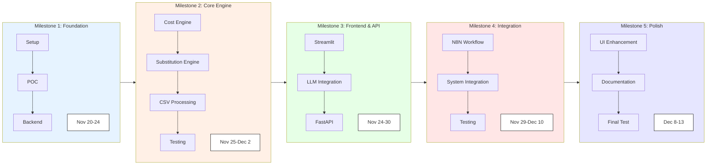
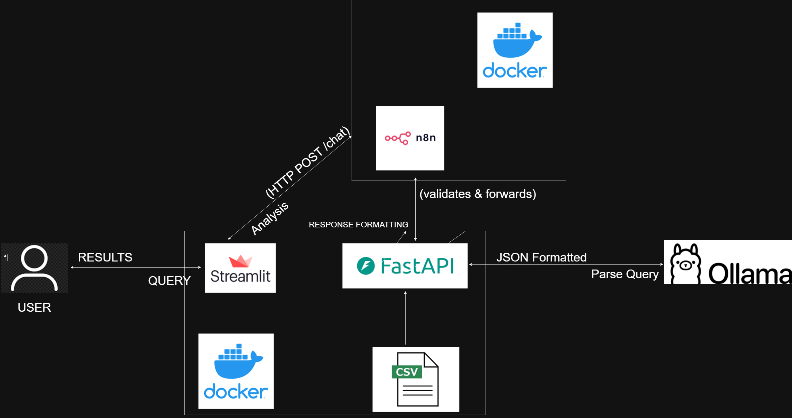

# Restaurant Consultant Management Chatbot Using LLM Frameworks

### Goal of the Project
- Analyze ingredient cost impacts and supply chain disruptions for restaurant operations
- Provide intelligent substitution recommendations for menu optimization
- Automate cost calculation and risk assessment processes
- Enhance decision-making through explainable AI analysis
- Reduce manual effort in menu cost management and supplier negotiations

### Project Overview
The Restaurant Consultant Management Chatbot is an AI-powered application designed to help restaurant operators manage ingredient costs and supply chain risks. The system leverages natural language processing to analyze price shocks, supply delays, and menu cost breakdowns while providing actionable substitution recommendations. Through integrated cost and substitution engines, the chatbot serves as an intelligent consultant for restaurant decision-makers, enabling them to optimize menu profitability and maintain operational continuity during supply disruptions.

### Key Technologies Involved

- **Streamlit**: Interactive web interface with chat functionality and analysis history
- **FastAPI**: High-performance REST API with async support for query processing
- **Ollama**: Local LLM deployment for natural language query parsing
- **N8N**: Workflow orchestration and automation layer
- **Pandas**: Data processing and analysis from CSV datasets
- **Docker**: Application containerization and environment standardization
- **Python**: Backend development with type hints and data validation

### Project Plan and Timeline



### Architecture diagram ###



# Local LLM Chatbot Setup (Ollama + FastAPI + Streamlit + N8N)

This guide walks you through installing and configuring all components required for the local LLM-powered chatbot system.

---

# Setup Instructions

## Prerequisites
- Docker and Docker Compose installed
- Python 3.9 or higher
- Git for version control

---

## 1. Clone the Repository
```bash
git clone https://github.com/your-repo/Restaurant-Consultant-Management-Chatbot-Using-LLM-frameworks.git
cd Restaurant-Consultant-Management-Chatbot-Using-LLM-frameworks
```

---

## 2. Environment Configuration
```bash
cd backend
cp .env.example .env
```

Update your `.env` file with the following configurations:

```bash
# Ollama Configuration
OLLAMA_URL=http://localhost:11434
OLLAMA_MODEL=llama3.2:1b

# N8N Configuration  
N8N_WEBHOOK_URL=http://localhost:8000/chat

# Data Configuration
DATA_PATH=/app/data
```

---

## 3. Ollama Setup
Install and configure Ollama for local LLM processing:

```bash
# Install Ollama (Linux/Mac)
curl -fsSL https://ollama.ai/install.sh | sh

# Start Ollama service
ollama serve

# Pull required model
ollama pull llama3.2:1b
```

---

## 4. N8N Workflow Setup
```bash
# Start N8N container
docker run -it --rm --name n8n -p 5678:5678 n8nio/n8n
```

- Open [http://localhost:5678](http://localhost:5678)  
- Import `n8n_workflow.json` from project root  
- Activate the workflow  

---

## 5. Start All Services with Docker Compose
Since you have `docker-compose.yml` configured, you can start all services at once:

```bash
# Build and start all services
docker-compose up --build
```


### Access Applications
- Streamlit: [http://localhost:8501](http://localhost:8501)  
- FastAPI: [http://localhost:8000](http://localhost:8000)  
- N8N: [http://localhost:5678](http://localhost:5678)  

```bash
# Stop services
docker-compose down
```

---

## Notes
- Make sure Docker is installed and running if you choose the containerized setup.  
- Ollama currently supports Linux and macOS. For Windows, use WSL2.  
- Ensure `requirements.txt` includes all necessary Python dependencies for both backend and frontend.  
# Data Files & Testing Guide

This document provides details on the required data files and how to test the system.

---

##  Data Files

The system requires **four CSV files** in the `/data` directory:

1. **ingredients.csv**  
   - Contains base costs, suppliers, and lead times  
   - ~40 ingredients  

2. **menu.csv**  
   - Defines dish prices and categories  
   - ~12 menu items  

3. **menu_bom.csv**  
   - Ingredient quantities per dish (Bill of Materials)  
   - ~57 entries  

4. **substitutions.csv**  
   - Allowed ingredient swaps with rationale  
   - ~18 substitution rules  

---

##  Testing the System

1. Open the **Streamlit interface** at:  
    [http://localhost:8501](http://localhost:8501)

2. Try example queries:
   - `"The price of tomato_sauce has increased by 22%"`
   - `"Shipments of 00_flour are delayed by 5 days"`
   - `"Show me pasta dish cost breakdowns"`

3. Features to explore:
   - **Analysis Results & Substitution Recommendations**  
   - **Analysis History Tab** → for session tracking  
   - **Business Rules Tab** → for system transparency  

---
